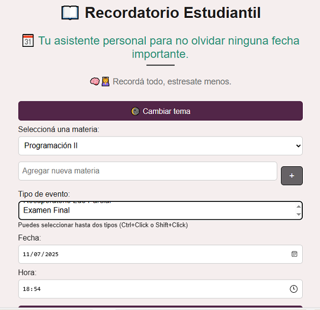

🌐 Portafolio de Proyectos – Nelly Dev

Soy Nelly 👩‍💻 Estudiante de programación en formación, apasionada por crear soluciones tecnológicas accesibles y funcionales. 
Este portafolio recopila los proyectos en los que estoy trabajando y los conocimientos que estoy adquiriendo.

---

📌 Proyecto destacado: [Recordatorio Estudiantil](https://nellyburgos.github.io/recordatorio-estudiantil/)

Una aplicación web diseñada para ayudar a estudiantes a gestionar sus eventos académicos como parciales, entregas, exámenes y más.

🚀 Tecnologías usadas

- HTML 
- CSS 
- JavaScript 

🖼 Captura

---

👩‍💻 Desarrollada por

*Nelly* – 2025  
📫 [Mi perfil de GitHub](http://github.com/NellyBurgos)

---

🔗 Enlaces útiles

- 📁 [Ver repositorio del proyecto](https://github.com/NellyBurgos/recordatorio-estudiantil.git)
- 🌐 [Ver proyecto online](https://nellyburgos.github.io/recordatorio-estudiantil/)
